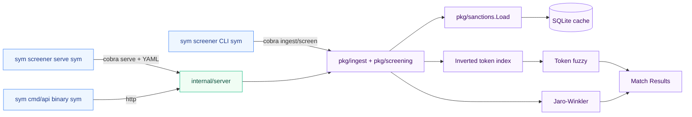

# sanctions-screener

[](https://go.dev/)
[](https://github.com/jstreitberger03/sanctions-screener/actions/workflows/ci.yml)
[](LICENSE)

A production-ready Go library, CLI, and REST API for screening names against sanctions lists (OFAC, EU consolidated, UN). Built for correctness, explainability, and cross-script matching — including Latin ↔ Cyrillic transliteration, token-based name comparison, and order-independent scoring.

## Features

- **Cross-script matching**: Cyrillic names are automatically transliterated into Latin search variants, so `Vladimir Putin` matches `Владимир Путин`.
- **Unicode normalization**: NFC composition, language-independent case folding, diacritic removal, and punctuation-aware variants.
- **Token-based matching**: Handles reversed name order, missing or extra middle names, initials, and compact initials like `J. P. Smith` or `JP Smith`.
- **Explainable matches**: Every match includes `MatchExplain` with the normalized input variant, matched list variant, method, and sub-scores.
- **Threshold validation**: Invalid thresholds (`<= 0` or `> 1`) return clear errors instead of silently producing empty results.
- **Multiple consumption modes**: Use as a Go package, CLI, or REST API.
- **High performance**: Inverted-token index for candidate retrieval; full EU dataset (5,885 entries) screens in ~5–6 ms per query after index build.

## Demo

```bash
$ screener ingest --source jsonl --data eu_sanctions.jsonl
Imported 5885 entries from jsonl

$ screener screen --name "Vladimir Putin"
[1.00] Влади́мир Влади́мирович ПУ́ТИН (fuzzy, transliterated exact) — EU
[0.89] Vladimir LIPCHENKO (fuzzy) — EU

$ screener screen --name "Владимир Путин"
[1.00] Влади́мир Влади́мирович ПУ́ТИН (fuzzy, transliterated exact) — EU

$ screener screen --name "Smith John"
[0.92] John SMITH (fuzzy) — EU
```

## Quick start

```bash
git clone https://github.com/jstreitberger03/sanctions-screener.git
cd sanctions-screener

make install-hooks   # enables pre-commit binary check
make build             # ./bin/screener and ./bin/api

# Ingest a sample list
./bin/screener ingest --source json --data data/eu_sample.json

# Screen a single name
./bin/screener screen --name "Irina Kostenko"

# Custom database path (default: ./sanctions.db)
./bin/screener --db mylists.db ingest --source json --data data/eu_sample.json

# Start the REST API (default :8080; reads PORT and SCREENER_DB_PATH env vars)
./bin/api

# Or use the CLI serve command with YAML config
./bin/screener serve --port 8080 --config config/config.yaml
```

The `make install-hooks` step sets `core.hooksPath=.githooks` so the shipped pre-commit hook is active in your local clone. The hook sniffs staged files for ELF, Mach-O, and PE magic bytes; if any are detected it unstages them, appends a `/<name>` entry to `.gitignore`, and aborts the commit so you never accidentally ship a `go build` artifact. Use `git commit --no-verify` for an intentional binary release.

## Library usage

```go
import (
    "github.com/jstreitberger03/sanctions-screener/pkg/ingest"
    "github.com/jstreitberger03/sanctions-screener/pkg/models"
    "github.com/jstreitberger03/sanctions-screener/pkg/screening"
)

store, err := ingest.NewStore("sanctions.db")
if err != nil { /* ... */ }
defer store.Close()

// Import returns the in-memory persons it just parsed; LoadCached re-reads
// from SQLite so subsequent calls (e.g. from the API server) hit the cache
// instead of re-parsing the file.
if _, err := store.ImportJSONL("eu_sanctions.jsonl"); err != nil { /* ... */ }
persons, _ := store.LoadCached(models.ListEU)

matches := screening.Screen("John Smith", persons, 0.8)
for _, m := range matches {
    fmt.Printf("[%.2f] %s (%s)\n", m.Score, m.Person.Name, m.MatchType)
}
```

## CLI reference

| Command | Purpose |
|---------|---------|
| `screener ingest` | Import and cache a sanctions list |
| `screener screen` | Screen a single name or a CSV file of names |
| `screener serve` | Start the REST API server (delegated to `internal/server`) |
| `screener version` | Print version, commit, build date |

Global flag: `--db PATH` — SQLite cache location (default `sanctions.db`).

### `ingest`

```bash
screener ingest --source <ofac|eu|json|jsonl> --data <path>
```

| `--source` | Format |
|------------|--------|
| `ofac` | OFAC SDN CSV (id, name, nationality columns) |
| `eu` | EU consolidated simplified JSON |
| `jsonl` | OpenSanctions FollowTheMoney JSONL (`eu_fsf/entities.ftm.json`) |
| `json` | Simple JSON array of `Person` objects |

Persisting to SQLite happens inside the same transaction so subsequent ingests fully replace prior rows for the affected list.

### `screen`

```bash
screener screen --name "John Smith"
screener screen --name "John Smith" --threshold 0.85 --list OFAC,EU
screener screen --file names.csv --output results.json
```

- Without `--file`, `--name` is required.
- `--list` accepts a comma-separated subset of `OFAC,EU,UN` (default: all).
- `--output` writes the matches as JSON instead of human-readable text.

The CSV input for `--file` expects a header row with one of `name`, `full_name`, `fullname`, or `entity_name`; any header is detected and skipped.

### `serve`

Reads optional YAML config (`config/config.yaml`) for `server.port`, `server.db_path`, and `screening.default_threshold`. CLI flags override config values; defaults from the YAML are used only when flags are not explicitly set.

## REST API

The OpenAPI 3.1 spec at [`api/v1/openapi.yaml`](api/v1/openapi.yaml) is the machine-readable source of truth. Quick reference:

### Endpoints

| Method | Path | Purpose |
|--------|------|---------|
| `GET`  | `/api/v1/health` | Health check |
| `POST` | `/api/v1/screen` | Screen a single name |
| `POST` | `/api/v1/screen/batch` | Screen multiple names in one request |
| `GET`  | `/api/v1/lists` | List available sanctions lists + entry counts |
| `GET`  | `/api/v1/lists/{id}/count` | Entry count for a specific list |

CORS is enabled for all origins (`*`) by default with a 1 MB request size limit and a 30 s request timeout.

### Health

```bash
curl -s http://localhost:8080/api/v1/health
# {"status":"ok"}
```

### Single screen

```bash
curl -X POST http://localhost:8080/api/v1/screen \
  -H "Content-Type: application/json" \
  -d '{"name":"Irina Kostenko","threshold":0.8,"lists":["EU"]}'
```

```json
{
  "matches": [
    {
      "person_id": "NK-23dinXRmxTu4sehASYNAGE",
      "name": "Ірина Анатоліївна КОСТЕНКО",
      "score": 0.85,
      "match_type": "fuzzy",
      "list": "EU",
      "nationality": "UA"
    }
  ],
  "screening_time_ms": 1,
  "input_name": "Irina Kostenko",
  "count": 1
}
```

### Batch screen

```bash
curl -X POST http://localhost:8080/api/v1/screen/batch \
  -H "Content-Type: application/json" \
  -d '{
        "names": ["John Smith", "Irina Kostenko", "Unknown Person"],
        "threshold": 0.85,
        "lists": ["OFAC", "EU"]
      }'
```

```json
{
  "results": [
    {
      "matches": [{ "person_id": "...", "score": 1.0, "match_type": "exact", "...": "..." }],
      "input_name": "John Smith",
      "count": 1
    },
    {
      "matches": [{ "...": "..." }],
      "input_name": "Irina Kostenko",
      "count": 1
    },
    {
      "matches": [],
      "input_name": "Unknown Person",
      "count": 0
    }
  ],
  "screening_time_ms": 18,
  "total_matches": 2
}
```

The batch handler processes small batches (`< 8` names) sequentially to avoid goroutine overhead, and fans out larger batches to a fixed worker pool sized to `min(runtime.GOMAXPROCS, len(names))` with `sync.WaitGroup`. Each worker recovers from panics locally so a single bad screening cannot crash the server. Threshold defaults to `0.8`.

### Lists

```bash
curl -s http://localhost:8080/api/v1/lists
# [{"id":"OFAC","name":"OFAC","count":0},{"id":"EU","name":"EU","count":5885},{"id":"UN","name":"UN","count":0}]

curl -s http://localhost:8080/api/v1/lists/EU/count
# {"list":"EU","count":5885}
```

## How matching works

### Normalization pipeline

Names are normalized in [`pkg/sanctions/normalize.go`](pkg/sanctions/normalize.go):

1. **NFC canonical composition** — unifies decomposed input into composed form.
2. **Unicode case folding** — language-independent lowercasing (handles Turkish i/I, Cyrillic, Greek, etc.).
3. **Trim and collapse whitespace** — removes leading/trailing spaces and collapses multiple spaces.
4. **Diacritic stripping** — NFD decomposition, removal of combining marks (`unicode.Mn`), then NFC recomposition. Special cases: `ß → ss`, `ł → l`, `Ł → L`.
5. **Punctuation variants** — generates two forms:
   - *Base*: punctuation replaced by spaces (`J. P. Smith` → `j p smith`).
   - *No-punctuation*: punctuation removed and consecutive initials compacted (`J. P. Smith` → `jp smith`).
6. **Cyrillic transliteration** — for Cyrillic text, produces Latin variants using two schemes (ICAO-style and BGN/PCGN-style) to cover common ambiguities.

### Candidate retrieval and scoring

The screening engine in [`pkg/screening`](pkg/screening/) separates candidate generation from final scoring:

1. **Candidate generation**: an inverted-token index maps every normalized token to the list entries that contain it. Queries are tokenized and looked up in the index; the union of hits becomes the candidate set. A small-data fallback performs a linear scan when the candidate set is empty.
2. **Final scoring**: each candidate is evaluated with:
   - **Exact match** — byte-for-byte equality of normalized variants (score 1.0).
   - **Alias match** — exact equality against a `Person.Aliases` entry (score 0.95, gated by threshold).
   - **Transliterated exact** — Latin transliteration of a Cyrillic name matches the query exactly.
   - **Token fuzzy** — order-independent best-match assignment of tokens, with penalties for missing/extra tokens and a small surname boost.
   - **String fuzzy** — Jaro-Winkler similarity on the full normalized string.
   - **Initials expansion** — compact-initial queries like `JP Smith` are expanded and rescored.

Results are sorted by score descending; only scores `>= threshold` are returned.

### Match types

| `match_type` | Score | Triggered when |
|--------------|-------|----------------|
| `exact` | 1.0 | Input normalizes to byte-for-byte equality with the primary sanctions name. |
| `alias` | 0.95 | Input matches a `Person.Aliases` entry exactly. Blocked when threshold > 0.95. |
| `fuzzy` | 0.0–1.0 | Token-based or full-string Jaro-Winkler similarity above threshold. |
| `initial` | 0.0–1.0 | Input matches the person's initials and expands successfully. |

Extended match types are available in `models.MatchExplain.Method` for debugging: `exact_primary`, `exact_alias`, `transliterated_exact`, `token`, `fuzzy`.

### Cross-script example

```text
Query:  Vladimir Putin
List:   Влади́мир Влади́мирович ПУ́ТИН
Result: transliterated exact match, score 1.00

Query:  Ирина Костенко
List:   Irina KOSTENKO
Result: transliterated exact match, score 1.00
```

### Token matching examples

| Query | List name | Result |
|-------|-----------|--------|
| `Smith John` | `John Smith` | fuzzy match, score ~0.92 |
| `John Paul Smith` | `John Smith` | fuzzy match, missing middle name penalized |
| `John Smith` | `John Paul Smith` | fuzzy match, extra middle name penalized |
| `J P Smith` | `John Paul Smith` | initials expansion → high fuzzy score |
| `O'Brien` | `O Brien` | exact match after punctuation normalization |
| `Al-Sayed` | `Al Sayed` | exact match after punctuation normalization |

## Performance

Run benchmarks with:

```bash
go test -bench=. -benchmem ./pkg/screening
make bench-full   # downloads full EU dataset and runs extended benchmarks
```

Apple M4 (10-core), Go 1.26.

### Screening engine

| Benchmark | Persons | Time | Allocs/op |
|-----------|---------|------|-----------|
| `BenchmarkScreen` | 4 | ~2.4 µs | ~50 |
| `BenchmarkScreenLarge` | 500 | ~122 µs | ~4,510 |
| `BenchmarkScreenFullDataset` | **5,885** (real EU list) | ~130 ms | ~544,656 |
| `BenchmarkScreenIndexFullDataset` | **5,885** | ~5.6 ms | ~9,692 |
| `BenchmarkJaroWinkler` | (micro) | ~33 ns | 0 |

`BenchmarkScreenFullDataset` measures the full path including index build per query; `BenchmarkScreenIndexFullDataset` reuses a pre-built index. The latter is the relevant server-path metric.

### Throughput estimate

- Single-threaded, index reused: ~180 q/s against the full EU list.
- Batch endpoint with 10 cores: ~600 q/s aggregate.
- Interactive API SLAs (p99 < 200 ms) are comfortably met.

Caching keeps the in-memory persons slice alive across requests with a 60 s TTL.

### Import performance

| Benchmark | Entries | Time |
|-----------|---------|------|
| CSV parse (SDN sample) | 5 | ~40 µs |
| JSON parse (EU sample) | 100 | ~262 µs |
| SQLite `cache` (transactional) | 100 | ~820 µs |

Wrapping INSERTs in a single transaction brought cache write time from ~50 ms to <1 ms (57× improvement).

## Architecture

```
cmd/screener/     CLI (cobra) — ingest, screen, serve, version
cmd/api/          Standalone REST API entrypoint (reads PORT, SCREENER_DB_PATH)
pkg/models/       Person, Match, MatchType, MatchExplain
pkg/sanctions/    Normalize, transliteration, tokenization, Load
pkg/screening/    Screen, BuildIndex, matchPerson, Jaro-Winkler, token matching
pkg/ingest/       SQLite cache, Import{JSON,JSONL,OFAC,EU}, LoadCached
internal/server/  chi router, handlers, in-memory person cache, graceful shutdown
api/v1/           OpenAPI 3.1 spec
```



### Data flow

1. **Ingest**: raw file → `pkg/sanctions.Load` → `pkg/sanctions.NormalizeVariants` → `pkg/ingest.cache` (transactional SQLite write).
2. **Screen**: in-memory `[]models.Person` from cache → `BuildIndex()` → inverted-token candidate lookup → per-candidate scoring → sorted `[]Match` with score ≥ threshold.

## Testing

```bash
go test -race ./...                     # all packages
go test -race ./pkg/screening/...       # engine + edge cases
go test -bench=. -benchmem ./pkg/...    # benchmark suite
make bench-full                         # full EU dataset benchmark
```

Test coverage focuses on:

- **Matching correctness**: exact, alias, fuzzy, transliterated, and initials paths. Pinned by `pkg/screening/screening_test.go`.
- **Algorithm edges**: classic JW transpositions (`martha`/`marhta`, `dwayne`/`duane`), prefix capping at 4, no-overlap case. See `pkg/screening/jaro_winkler_test.go`.
- **Unicode/IO corners**: Cyrillic/CJK/Arabic exact match, punctuation variants, reversed name order, NFC vs NFD, multi-language alias pipelines. See `pkg/screening/screening_edge_test.go`.
- **Cross-script matching**: Latin ↔ Cyrillic transliteration tests in `pkg/sanctions/translit_test.go` and `pkg/screening/screening_test.go`.
- **HTTP integration**: chi router, CORS preflight, batch endpoint, graceful shutdown. See `internal/server/server_test.go`.
- **Cache invariant**: 60 s TTL refresh + double-checked locking. See `internal/server/cache_test.go`.

## Docker

```bash
docker build \
  --build-arg VERSION=$(git describe --tags --always) \
  --build-arg COMMIT=$(git rev-parse --short HEAD) \
  --build-arg DATE=$(date -u +%Y-%m-%dT%H:%M:%SZ) \
  -t sanctions-screener .

docker run -p 8080:8080 sanctions-screener                         # CLI: serve via the default CMD
docker run -p 8080:8080 --entrypoint ./api sanctions-screener      # standalone API binary
```

The base image is `alpine:3.19` with `sqlite-libs` and `ca-certificates` installed; the build stage adds `gcc`/`musl-dev`/`sqlite-dev` for CGO-enabled `mattn/go-sqlite3`.

## Data sources

OpenSanctions publishes the canonical feeds used here:

- [EU Consolidated Financial Sanctions Files](https://data.opensanctions.org/datasets/latest/eu_fsf/entities.ftm.json) — 5,885 entities as of 2026-07-08 (4,340 persons, 1,545 organizations).
- OFAC SDN — distributed as CSV; sample in `data/sdn_sample.csv`.
- UN Consolidated List — JSON (planned; not yet shipped).

A 100-entry EU JSON sample ships in `data/eu_sample.json` for demos and testing without external downloads.

## License

MIT — see [`LICENSE`](LICENSE).
