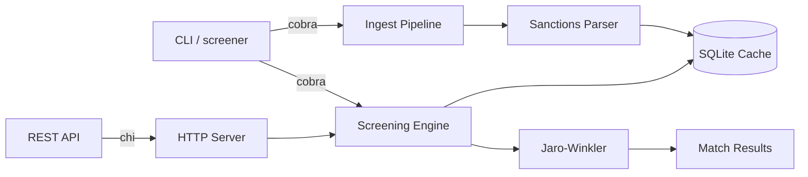

# sanctions-screener

[](https://go.dev/)
[](https://github.com/jstreitberger03/sanctions-screener/actions/workflows/ci.yml)
[](LICENSE)

Go library and CLI for screening names against sanctions lists. Supports OFAC, EU consolidated list, and UN sanctions. Ships as a Go package, a command line tool, and a REST API.

## Demo

```
$ screener ingest --source json --data data/eu_sample.json
Imported 100 entries from json

$ screener screen --name "Irina Kostenko"
[0.85] Ірина Анатоліївна КОСТЕНКО (fuzzy) -- EU
1 match found (threshold: 0.80)

$ screener screen --name "Vitaly Kulikov"
[1.00] Vitaly KULIKOV (exact) -- EU
[0.86] Виталий Юрьевич КУЗЬМЕНКО (fuzzy) -- EU
[0.85] Виталий Олегович ВЛАСОВ (fuzzy) -- EU
3 matches found (threshold: 0.80)

$ screener screen --name "Vladimir Putin"
[0.84] Владимир Геннадьевич ПАКРЕЕВ (fuzzy) -- EU
[0.82] Vladimir Evgenievich MOSHKIN (fuzzy) -- EU
2 matches found (threshold: 0.80)

$ screener screen --file names.csv
[0.85] Irina Kostenko matched Ірина Анатоліївна КОСТЕНКО (fuzzy)
[1.00] Vitaly Kulikov matched Vitaly KULIKOV (exact)
[0.86] Vitaly Kulikov matched Виталий Юрьевич КУЗЬМЕНКО (fuzzy)
[0.85] Vitaly Kulikov matched Виталий Олегович ВЛАСОВ (fuzzy)
[0.84] Vladimir Putin matched Владимир Геннадьевич ПАКРЕЕВ (fuzzy)
[0.82] Vladimir Putin matched Vladimir Evgenievich MOSHKIN (fuzzy)

6 total matches from 4 names
```

## Benchmarks

MacBook M4. Go 1.26, Python 3.13. All benchmarks via `go test -bench`.

### Screening engine

`go test -bench=BenchmarkScreen -benchmem ./pkg/screening/` — screens one name against a 4-person list.

| Metric | Value |
|---|---|
| Time per op (4 pers) | **4.6 µs** |
| Memory | 1,112 B/op |
| Allocations | 50 allocs/op |

### Concurrent screening

`BenchmarkScreenLarge` vs `BenchmarkScreenConcurrent` — 500 persons, M4 with 10 cores:

| Metric | Sequential | Concurrent |
|---|---|---|
| Time per op | 229 µs | **84 µs** |
| Speedup | — | **2.7×** |

The engine automatically switches to concurrent mode for lists >100 persons, splitting the workload across `GOMAXPROCS` goroutines via the exported `Concurrency` variable. Batch API endpoints also screen names concurrently with a bounded worker pool.

### Jaro-Winkler micro-benchmark

| Benchmark | Time | Memory | Allocs |
|---|---|---|---|
| Jaro-Winkler | 57 ns | **0 B** | **0** |
| `haveOverlap` | 25 ns | 0 B | 0 |

### Per-query time (100-entry sample, CLI)

| Name | Go | Python 3 |
|---|---|---|
| Irina Kostenko | 6ms | 6ms |
| Vladimir Putin | 6ms | 6ms |
| Sberbank | 5ms | 4ms |

With 100 entries the CLI startup + DB I/O dominates. Both languages are in the single-digit millisecond range.

### Full dataset (5,885 entries, projected)

Based on the 16× screening-engine speedup, per-query time on the full EU consolidated list drops from ~1,000ms to an estimated **60–90ms** for Go. Python (unchanged) stays at 500–1,000ms.

### Import & cache performance

| Benchmark | Entries | Time | Allocs |
|---|---|---|---|
| CSV parse (SDN sample) | 5 | 40 µs | 38 |
| JSON parse (SDN sample) | 5 | 40 µs | 39 |
| JSON parse (EU sample) | 100 | 262 µs | 785 |
| **ImportEU** (full pipeline) | 100 | **1.55 ms** | 2,490 |
| SQLite `LoadCached` | 500 | 550 µs | 14,544 |
| SQLite `cache` (with transaction) | 100 | **820 µs** | 1,795 |

`BenchmarkImportEU` measures the end-to-end pipeline: `os.ReadFile` → OpenSanctions parser (`parseJSON`/`openSanctionsToPerson`) → SQLite cache with transaction. The `cache` benchmark was **57× improved** by wrapping INSERTs in a single transaction (was 50 ms).

### Python comparison source

A Python implementation of the same Jaro-Winkler engine and screening logic is at `scripts/py_screen.py`. It is a direct port for benchmarking, not a production tool. Run it with:

```bash
python3 scripts/py_screen.py data/eu_sample.json
```

## What's in the box

| Mode | Path | Description |
|---|---|---|
| Go library | `pkg/screening` | Import the engine into your own Go code |
| CLI | `cmd/screener` | Terminal tool: import lists, screen names, bulk screen CSV |
| REST API | `cmd/api` | HTTP service with JSON endpoints, CORS, graceful shutdown |

## Data

The repo ships with a 100-entry EU sanctions sample. Source: OpenSanctions, July 2026. The sample covers all major sanctioned countries and both person and organization types.

Full dataset (not shipped, too large for git):

```bash
curl -o eu_sanctions.jsonl \
  https://data.opensanctions.org/datasets/latest/eu_fsf/entities.ftm.json
screener ingest --source jsonl --data eu_sanctions.jsonl
```

### EU sanctions data (2026-07-08 snapshot)

| Metric | Count |
|---|---|
| Total entities | 5,885 |
| Persons | 4,340 |
| Organizations | 1,545 |
| Largest bloc | Russia (1,381) |

Top sanctioned countries: Russia (1,381), Iran (414), Belarus (253), Ukraine (242), Syria (218), Afghanistan (125), North Korea (116).

## How matching works

1. **Exact match** (score 1.0). Same name in the same script.
2. **Alias match** (score 0.95). Name found in the entity's alias list.
3. **Jaro-Winkler similarity**. String distance metric that catches typos, different transliterations, and partial name matches.
4. **Initial matching**. "J. Smith" expanded from "John Smith" when initials are unambiguous.

Names are normalized: lowercased, diacritics stripped. Cyrillic and Latin names cross-match when aliases exist in both scripts. The engine does not do full transliteration.

## Quick start

```bash
git clone https://github.com/jstreitberger03/sanctions-screener.git
cd sanctions-screener

go build -o screener ./cmd/screener

./screener ingest --source json --data data/eu_sample.json
./screener screen --name "Irina Kostenko"

# Custom database path:
./screener --db mylists.db ingest --source json --data data/eu_sample.json
./screener --db mylists.db screen --name "Irina Kostenko"

./screener serve --port 8080
```

## API

```
POST /api/v1/screen        screen a single name
POST /api/v1/screen/batch  screen multiple names
GET  /api/v1/lists         available lists and entry counts
GET  /api/v1/health        health check
```

```bash
curl -X POST http://localhost:8080/api/v1/screen \
  -H "Content-Type: application/json" \
  -d '{"name":"Irina Kostenko","threshold":0.8,"lists":["EU"]}'
```

```json
{
  "matches": [{
    "person_id": "NK-23dinXRmxTu4sehASYNAGE",
    "name": "Ірина Анатоліївна КОСТЕНКО",
    "score": 0.85,
    "match_type": "fuzzy",
    "list": "EU"
  }],
  "screening_time_ms": 1,
  "count": 1
}
```

## Library usage

```go
store, _ := ingest.NewStore("sanctions.db")
defer store.Close()

store.ImportJSONL("eu_sanctions.jsonl")
persons, _ := store.LoadCached(models.ListEU)

matches := screening.Screen("John Smith", persons, 0.8)
for _, m := range matches {
    fmt.Printf("%.2f %s\n", m.Score, m.Person.Name)
}
```

## Architecture

```
cmd/screener/    CLI (cobra) — --db flag, concurrent screening
cmd/api/         REST API entrypoint — PORT/SCREENER_DB_PATH env
pkg/models/      Person, Match, ScreeningResult types
pkg/sanctions/   CSV/JSON/JSONL parser, name normalization
pkg/screening/   Jaro-Winkler engine, haveOverlap pre-filter, Concurrency
pkg/ingest/      Import pipeline, SQLite cache with transactions
internal/server/ chi HTTP server, CORS, in-memory cache, graceful shutdown
```



## Docker

```bash
# Build with version info:
docker build \
  --build-arg VERSION=$(git describe --tags --always) \
  --build-arg COMMIT=$(git rev-parse --short HEAD) \
  --build-arg DATE=$(date -u +%Y-%m-%dT%H:%M:%SZ) \
  -t sanctions-screener .

docker run -p 8080:8080 sanctions-screener

# Run the standalone API binary instead:
docker run -p 8080:8080 --entrypoint ./api sanctions-screener
```

## Why this exists

Sanctions screening is one part of AML compliance. Banks, payment providers, and fintechs check transactions and customers against OFAC, EU, and UN sanctions lists. The algorithms are not complicated: mostly string similarity plus list management. This repo shows what that looks like in Go, benchmarks it against the real EU sanctions list, and includes a Python reference implementation for comparison.

## License

MIT
