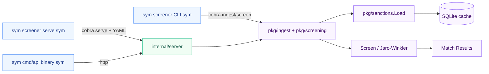

# sanctions-screener

[](https://go.dev/)
[](https://github.com/jstreitberger03/sanctions-screener/actions/workflows/ci.yml)
[](LICENSE)

Go library, CLI, and REST API for screening names against OFAC, EU consolidated,
and UN sanctions lists. Ships as three interchangeable consumption modes.

## Demo

```
$ screener ingest --source json --data data/eu_sample.json
Imported 100 entries from json

$ screener screen --name "Irina Kostenko"
[0.85] Ірина Анатоліївна КОСТЕНКО (fuzzy) — EU

1 match found (threshold: 0.80)

$ screener screen --file names.csv
[0.85] Irina Kostenko matched Ірина Анатоліївна КОСТЕНКО (fuzzy)
[1.00] Vitaly Kulikov   matched Vitaly KULIKOV                (exact)
[0.86] Vitaly Kulikov   matched Виталий Юрьевич КУЗЬМЕНКО     (fuzzy)
[0.85] Vitaly Kulikov   matched Виталий Олегович ВЛАСОВ       (fuzzy)
[0.84] Vladimir Putin   matched Владимир Геннадьевич ПАКРЕЕВ  (fuzzy)

6 total matches from 4 names
```

## Quick start

```bash
git clone https://github.com/jstreitberger03/sanctions-screener.git
cd sanctions-screener

make install-hooks                            # enables pre-commit binary check
make build                                    # ./bin/screener and ./bin/api

./bin/screener ingest --source json \
    --data data/eu_sample.json
./bin/screener screen --name "Irina Kostenko"

# Custom database path (default: ./sanctions.db):
./bin/screener --db mylists.db ingest \
    --source json --data data/eu_sample.json

# API server (default :8080; reads PORT and SCREENER_DB_PATH env):
./bin/api

# Or run the CLI serve command with YAML config:
./bin/screener serve --port 8080 --config config/config.yaml
```

The `make install-hooks` step sets `core.hooksPath=.githooks` so the
shipped pre-commit hook is active in your local clone. The hook sniffs
staged files for ELF, Mach-O, and PE magic bytes; if any are detected
it unstages them, appends a `/<name>` entry to `.gitignore`, and aborts
the commit so you never accidentally ship a `go build` artifact. Use
`git commit --no-verify` for an intentional binary release.

## Library usage

```go
import (
    "github.com/jstreitberger03/sanctions-screener/pkg/ingest"
    "github.com/jstreitberger03/sanctions-screener/pkg/models"
    "github.com/jstreitberger03/sanctions-screener/pkg/screening"
)

store, err := ingest.NewStore("sanctions.db")
if err != nil { /* ... */ }
defer store.Close()

// Import returns the in-memory persons it just parsed; LoadCached re-reads
// from SQLite so subsequent calls (e.g. from the API server) hit the cache
// instead of re-parsing the file.
if _, err := store.ImportJSONL("eu_sanctions.jsonl"); err != nil { /* ... */ }
persons, _ := store.LoadCached(models.ListEU)

matches := screening.Screen("John Smith", persons, 0.8)
for _, m := range matches {
    fmt.Printf("[%.2f] %s (%s)\n", m.Score, m.Person.Name, m.MatchType)
}
```

## CLI reference

| Command | Purpose |
|---------|---------|
| `screener ingest` | Import and cache a sanctions list |
| `screener screen` | Screen a single name or a CSV file of names |
| `screener serve` | Start the REST API server (delegated to `internal/server`) |
| `screener version` | Print version, commit, build date |

Global flag: `--db PATH` — SQLite cache location (default `sanctions.db`).

### `ingest`

```bash
screener ingest --source <ofac|eu|json|jsonl> --data <path>
```

| `--source` | Format |
|------------|--------|
| `ofac` | OFAC SDN CSV (id, name, nationality columns) |
| `eu` | EU consolidated simplified JSON |
| `jsonl` | OpenSanctions FollowTheMoney JSONL (`eu_fsf/entities.ftm.json`) |
| `json` | Simple JSON array of `Person` objects |

Persisting to SQLite happens inside the same transaction so subsequent
ingests fully replace prior rows for the affected list.

### `screen`

```bash
screener screen --name "John Smith"
screener screen --name "John Smith" --threshold 0.85 --list OFAC,EU
screener screen --file names.csv --output results.json
```

- Without `--file`, `--name` is required.
- `--list` accepts a comma-separated subset of `OFAC,EU,UN` (default: all).
- `--output` writes the matches as JSON instead of human-readable text.

The CSV input for `--file` expects a header row with one of `name`,
`full_name`, `fullname`, or `entity_name`; any header is detected and
skipped.

### `serve`

Reads optional YAML config (`config/config.yaml`) for `server.port`,
`server.db_path`, and `screening.default_threshold`. CLI flags override
config values; defaults from the YAML are used only when flags are not
explicitly set.

## REST API

The OpenAPI 3.1 spec at [`api/v1/openapi.yaml`](api/v1/openapi.yaml) is the
machine-readable source of truth. Quick reference:

### Endpoints

| Method | Path | Purpose |
|--------|------|---------|
| `GET`  | `/api/v1/health` | Health check |
| `POST` | `/api/v1/screen` | Screen a single name |
| `POST` | `/api/v1/screen/batch` | Screen multiple names in one request |
| `GET`  | `/api/v1/lists` | List available sanctions lists + entry counts |
| `GET`  | `/api/v1/lists/{id}/count` | Entry count for a specific list |

CORS is enabled for all origins (`*`) by default with a 1 MB request size
limit and a 30 s request timeout.

### Health

```bash
curl -s http://localhost:8080/api/v1/health
# {"status":"ok"}
```

### Single screen

```bash
curl -X POST http://localhost:8080/api/v1/screen \
  -H "Content-Type: application/json" \
  -d '{"name":"Irina Kostenko","threshold":0.8,"lists":["EU"]}'
```

```json
{
  "matches": [
    {
      "person_id": "NK-23dinXRmxTu4sehASYNAGE",
      "name": "Ірина Анатоліївна КОСТЕНКО",
      "score": 0.85,
      "match_type": "fuzzy",
      "list": "EU",
      "nationality": "UA"
    }
  ],
  "screening_time_ms": 1,
  "input_name": "Irina Kostenko",
  "count": 1
}
```

### Batch screen

```bash
curl -X POST http://localhost:8080/api/v1/screen/batch \
  -H "Content-Type: application/json" \
  -d '{
        "names": ["John Smith", "Irina Kostenko", "Unknown Person"],
        "threshold": 0.85,
        "lists": ["OFAC", "EU"]
      }'
```

```json
{
  "results": [
    {
      "matches": [{ "person_id": "...", "score": 1.0, "match_type": "exact", "...": "..." }],
      "input_name": "John Smith",
      "count": 1
    },
    {
      "matches": [{ "...": "..." }],
      "input_name": "Irina Kostenko",
      "count": 1
    },
    {
      "matches": [],
      "input_name": "Unknown Person",
      "count": 0
    }
  ],
  "screening_time_ms": 18,
  "total_matches": 2
}
```

Small batches (`< 8` names) are processed sequentially to avoid
goroutine-spawn overhead; larger batches fan out across
`runtime.GOMAXPROCS` workers. Threshold defaults to `0.8`.

### Lists

```bash
curl -s http://localhost:8080/api/v1/lists
# [{"id":"OFAC","name":"OFAC","count":0},{"id":"EU","name":"EU","count":100},{"id":"UN","name":"UN","count":0}]

curl -s http://localhost:8080/api/v1/lists/EU/count
# {"list":"EU","count":100}
```

### Match types

| `match_type` | Score | Triggered when |
|--------------|-------|----------------|
| `exact` | 1.0 | Input normalizes to byte-for-byte equality with the sanctions name (including diacritic-stripped variants like `François` ↔ `Francois`). |
| `alias` | 0.95 | Input matches a `Person.Aliases` entry. Blocked silently when threshold > 0.95. |
| `fuzzy` | 0.0–1.0 | Jaro-Winkler similarity above threshold with ASCII bitmap pre-filter. |
| `initial` | 0.0–1.0 | Input matches the person's initials (`J. Smith` → `John Smith`); emitted only when the post-expansion score beats `fuzzy`. |

## How matching works

Names are normalized in [`pkg/sanctions`](pkg/sanctions/sanctions.go):

1. `golang.org/x/text/unicode/norm.NFC.String` — unifies decomposed
   (NFD) input into composed (NFC) form. Visually identical strings
   become byte-exact so the byte-sequence replacer in step 4 catches
   both encodings.
2. `strings.ToLower`
3. `strings.TrimSpace`
4. `diacriticReplacer.Replace` — strips common Latin diacritics via byte
   sequences (`ä→a`, `ø→o`, `ñ→n`, `ß→ss`, …). Multi-byte UTF-8 is
   preserved throughout.

For each candidate, `pkg/screening.matchPerson`:

1. **Exact** check on the primary name.
2. **Exact alias** check (each `Person.Aliases`) — early-return `nil` if
   blocked by threshold, deliberately avoiding fuzzy fallback so a
   `threshold=1.0` caller isn't silently served a 0.95-shaped match.
3. **Fuzzy**: `haveOverlap` bitmap pre-filter (skips JW when the two
   strings share zero ASCII characters) followed by Jaro-Winkler on
   primary name and each alias. Returns the highest-scoring variant.
4. **Initial** match: extract first letters of each token in the
   person name; if the input has prefix overlap or scores ≥ 0.9 against
   the initials, expand initials against the person name and rerun JW.

Sorted by score descending; results below threshold are not returned.

### Known limitations

These behaviours are intentional or documented in tests but worth being
explicit about:

| Limitation | Behaviour |
|------------|-----------|
| Cross-script transliteration | Not performed. `Vladimir Putin` does **not** match `Владимир Путин`. Operators must query in the same script the list was written in. |
| Reversed name order | "Smith John" does **not** match "John Smith" at threshold 0.8. Jaro-Winkler's match-distance window produces `~0.53` for these pairs. |
| Pure initialism query | `"JS"` does **not** match `"John Smith"`. The initials-expansion path produces `~0.76` (below threshold). |
| Punctuation variants | Apostrophes, hyphens, and dots are not stripped by `Normalize`. `O'Brien` vs `OBrien` falls through to fuzzy at ~0.92, which still matches at default thresholds. |
| Threshold ≤ 0 | Accepts any result with score ≥ 0 — including zero-character-overlap pairs that produce score 0.0. Callers must validate match quality separately. |

## Performance

`go test -bench=. -benchmem ./pkg/screening`. Apple M4 (10-core), Go 1.26,
Linux-style mid-2026 prices.

### Screening engine

| Benchmark | Persons | Time | Memory | Allocs |
|-----------|---------|------|--------|--------|
| `BenchmarkScreen` | 4 | 2.4 µs | 1.1 KB | 50 |
| `BenchmarkScreenLarge` | 500 | 122 µs | 72 KB | 4,510 |
| `BenchmarkScreenFullDataset` | **5,885** (real EU list) | ~16.8 ms | 5.3 MB | 119,265 |
| `BenchmarkJaroWinkler` | (micro) | 33 ns | 0 B | 0 |
| `BenchmarkHaveOverlap` | (micro) | 5 ns | 0 B | 0 |

`BenchmarkScreenFullDataset` requires the real OpenSanctions JSONL
(15 MB, 5,885 entries):

```bash
curl -o data/eu_sanctions.jsonl \
  https://data.opensanctions.org/datasets/latest/eu_fsf/entities.ftm.json
go test -bench=BenchmarkScreenFullDataset -benchtime=5x ./pkg/screening
```

### Batch parallelization threshold

`internal/server/server.go` ships a `batchSequentialThreshold = 8`
constant. The split is informed by `BenchmarkBatchSequentialVsParallel`,
which compares sequential vs. parallel screening at n=1, 2, 4, 8, 16, 32.
With a 4-person `testList` (per-name ~1.5 µs), the crossover lands
between n=4 and n=8. For heavier per-name work (full EU list ~16 ms),
parallel wins much earlier; 8 is a conservative midpoint.

### Throughput estimate

On the same Apple M4 (10-core) machine used for the benchmarks above,
single-threaded screening against the 5,885-entry EU list measures
**~16.8 ms per query**, or **~60 q/s**. With the batch endpoint fanning
out across cores: **~600 q/s** aggregate at 10 cores. Hardware with
slower single-thread performance or fewer cores will see proportionally
lower numbers; hardware with newer CPUs and additional cores will see
more. Typical interactive API SLAs (p99 < 200 ms) are comfortably met.
Caching keeps the in-memory persons slice alive across requests with a
`60 s` TTL.

### Import performance

| Benchmark | Entries | Time |
|-----------|---------|------|
| CSV parse (SDN sample) | 5 | 40 µs |
| JSON parse (EU sample) | 100 | 262 µs |
| SQLite `cache` (transactional) | 100 | 820 µs |

Wrapping INSERTs in a single transaction brought cache write time from
~50 ms to <1 ms (57× improvement).

## Architecture

```
cmd/screener/     CLI (cobra) — ingest, screen, serve, version
cmd/api/          Standalone REST API entrypoint (reads PORT, SCREENER_DB_PATH)
pkg/models/       Person, Match, MatchType
pkg/sanctions/    Normalize, Load (CSV/JSON/JSONL), parser
pkg/screening/    Screen, matchPerson, jaroWinkler, haveOverlap, initials
pkg/ingest/       SQLite cache, Import{JSON,JSONL,OFAC,EU}, LoadCached
internal/server/  chi router, handlers, in-memory person cache, graceful shutdown
api/v1/           OpenAPI 3.1 spec
```



### Data flow

1. **Ingest**: raw file → `pkg/sanctions.Load` → `pkg/sanctions.Normalize`
   → `pkg/ingest.cache` (transactional SQLite write).
2. **Screen**: in-memory `[]models.Person` from cache → `Screen()` →
   per-person `matchPerson()` → sorted `[]Match` with score ≥ threshold.

## Testing

```bash
go test -race ./...                     # all packages
go test -race ./pkg/screening/...       # engine + edge cases
go test -bench=. -benchmem ./pkg/...    # benchmark suite

# Full EU dataset benchmark (requires DB download):
make bench-full
```

Test coverage focuses on:

- **Matching correctness**: exact, alias-with-threshold-gating,
  fuzzy, and initial match paths. Pinned by `pkg/screening/screening_test.go`.
- **Algorithm edges**: classic JW transposition (`martha`/`marhta`,
  `dwayne`/`duane`), prefix capping at 4, no-overlap case.
  See `pkg/screening/jaro_winkler_test.go`.
- **Unicode/IO corners**: Cyrillic/CJK/Arabic exact match,
  punctuation variants, reversed name order, NFC vs NFD,
  multi-language alias pipelines. See
  `pkg/screening/screening_edge_test.go`.
- **HTTP integration**: chi router, CORS preflight, batch endpoint,
  graceful shutdown. See `internal/server/server_test.go`.
- **Cache invariant**: 60 s TTL refresh + double-checked locking.
  See `internal/server/cache_test.go`.

## Docker

```bash
docker build \
  --build-arg VERSION=$(git describe --tags --always) \
  --build-arg COMMIT=$(git rev-parse --short HEAD) \
  --build-arg DATE=$(date -u +%Y-%m-%dT%H:%M:%SZ) \
  -t sanctions-screener .

docker run -p 8080:8080 sanctions-screener                         # CLI: serve via the default CMD
docker run -p 8080:8080 --entrypoint ./api sanctions-screener      # standalone API binary
```

The base image is `alpine:3.19` with `sqlite-libs` and `ca-certificates`
installed; the build stage adds `gcc`/`musl-dev`/`sqlite-dev` for
CGO-enabled `mattn/go-sqlite3`.

## Data sources

OpenSanctions publishes the canonical feeds used here:

- [EU Consolidated Financial Sanctions Files](https://data.opensanctions.org/datasets/latest/eu_fsf/entities.ftm.json) — 5,885 entities as of 2026-07-08 (4,340 persons, 1,545 organizations).
- OFAC SDN — distributed as CSV; sample in `data/sdn_sample.csv`.
- UN Consolidated List — JSON (planned; not yet shipped).

A 100-entry EU JSON sample ships in `data/eu_sample.json` for demos and
testing without external downloads.

## License

MIT — see [`LICENSE`](LICENSE).
