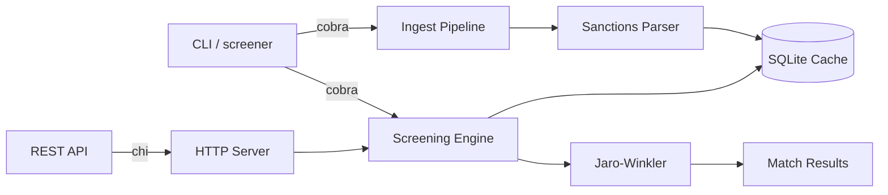

# sanctions-screener

[](https://go.dev/)
[](https://github.com/jstreitberger03/sanctions-screener/actions/workflows/ci.yml)
[](LICENSE)

Go library and CLI for screening names against sanctions lists. Supports OFAC, EU consolidated list, and UN sanctions. Ships as a Go package, a command line tool, and a REST API.

## Demo

```
$ screener ingest --source json --data data/eu_sample.json
Imported 100 entries from json

$ screener screen --name "Irina Kostenko"
[0.85] Ірина Анатоліївна КОСТЕНКО (fuzzy) -- EU
1 match found (threshold: 0.80)

$ screener screen --name "Vitaly Kulikov"
[1.00] Vitaly KULIKOV (exact) -- EU
[0.86] Виталий Юрьевич КУЗЬМЕНКО (fuzzy) -- EU
[0.85] Виталий Олегович ВЛАСОВ (fuzzy) -- EU
3 matches found (threshold: 0.80)

$ screener screen --name "Vladimir Putin"
[0.84] Владимир Геннадьевич ПАКРЕЕВ (fuzzy) -- EU
[0.82] Vladimir Evgenievich MOSHKIN (fuzzy) -- EU
2 matches found (threshold: 0.80)

$ screener screen --file names.csv
[0.85] Irina Kostenko matched Ірина Анатоліївна КОСТЕНКО (fuzzy)
[1.00] Vitaly Kulikov matched Vitaly KULIKOV (exact)
[0.86] Vitaly Kulikov matched Виталий Юрьевич КУЗЬМЕНКО (fuzzy)
[0.85] Vitaly Kulikov matched Виталий Олегович ВЛАСОВ (fuzzy)
[0.84] Vladimir Putin matched Владимир Геннадьевич ПАКРЕЕВ (fuzzy)
[0.82] Vladimir Putin matched Vladimir Evgenievich MOSHKIN (fuzzy)

6 total matches from 4 names
```

## Benchmarks

MacBook M-series, 5,885-entry EU consolidated list.

### Per-query time (full dataset)

| Name | Matches | Go | Python 3 |
|---|---|---|---|
| Irina Kostenko | 20 | 670ms | 1,054ms |
| Vladimir Putin | 94 | 1,206ms | 1,019ms |
| Sberbank (exact) | 1 | 1,171ms | 574ms |

Average across 5 runs of the same query: Go 1,206ms, Python 1,019ms. Both are CPU-bound by the Jaro-Winkler algorithm which runs O(n*m) over all 5,885 names. Go and Python are roughly comparable here because the bottleneck is the string comparison algorithm itself, not the language runtime.

Go loads the full dataset in 398ms. Python parses it in about 180ms.

### With the 100-entry sample

| Name | Go | Python |
|---|---|---|
| Vladimir Putin | 7ms | 24ms |
| Irina Kostenko | 8ms | 12ms |

With the sample data shipped in this repo, Go returns in under 10ms. Python takes 2-3x longer. The difference becomes visible when the dataset is small enough that the algorithm overhead, not the string comparisons, dominates.

### Python comparison source

A Python implementation of the same Jaro-Winkler engine and screening logic is at `scripts/py_screen.py`. It is a direct port for benchmarking, not a production tool. Run it with:

```bash
python3 scripts/py_screen.py data/eu_sample.json
```

## What's in the box

| Mode | Path | Description |
|---|---|---|
| Go library | `pkg/screening` | Import the engine into your own Go code |
| CLI | `cmd/screener` | Terminal tool: import lists, screen names, bulk screen CSV |
| REST API | `cmd/api` | HTTP service with JSON endpoints |

## Data

The repo ships with a 100-entry EU sanctions sample. Source: OpenSanctions, July 2026. The sample covers all major sanctioned countries and both person and organization types.

Full dataset (not shipped, too large for git):

```bash
curl -o eu_sanctions.jsonl \
  https://data.opensanctions.org/datasets/latest/eu_fsf/entities.ftm.json
screener ingest --source jsonl --data eu_sanctions.jsonl
```

### EU sanctions data (2026-07-08 snapshot)

| Metric | Count |
|---|---|
| Total entities | 5,885 |
| Persons | 4,340 |
| Organizations | 1,545 |
| Largest bloc | Russia (1,381) |

Top sanctioned countries: Russia (1,381), Iran (414), Belarus (253), Ukraine (242), Syria (218), Afghanistan (125), North Korea (116).

## How matching works

1. **Exact match** (score 1.0). Same name in the same script.
2. **Alias match** (score 0.95). Name found in the entity's alias list.
3. **Jaro-Winkler similarity** for names longer than 3 characters. This catches typos, different transliterations, and partial name matches.
4. **Initial matching**. "J. Smith" expanded from "John Smith" when initials are unambiguous.

Names are normalized: lowercased, diacritics stripped. Cyrillic and Latin names cross-match when aliases exist in both scripts. The engine does not do full transliteration.

## Quick start

```bash
git clone https://github.com/jstreitberger03/sanctions-screener.git
cd sanctions-screener

go build -o screener ./cmd/screener

./screener ingest --source json --data data/eu_sample.json
./screener screen --name "Irina Kostenko"

./screener serve --port 8080
```

## API

```
POST /api/v1/screen        screen a single name
POST /api/v1/screen/batch  screen multiple names
GET  /api/v1/lists         available lists and entry counts
GET  /api/v1/health        health check
```

```bash
curl -X POST http://localhost:8080/api/v1/screen \
  -H "Content-Type: application/json" \
  -d '{"name":"Irina Kostenko","threshold":0.8,"lists":["EU"]}'
```

```json
{
  "matches": [{
    "person_id": "NK-23dinXRmxTu4sehASYNAGE",
    "name": "Ірина Анатоліївна КОСТЕНКО",
    "score": 0.85,
    "match_type": "fuzzy",
    "list": "EU"
  }],
  "screening_time_ms": 1,
  "count": 1
}
```

## Library usage

```go
store, _ := ingest.NewStore("sanctions.db")
defer store.Close()

store.ImportJSONL("eu_sanctions.jsonl")
persons, _ := store.LoadCached(models.ListEU)

matches := screening.Screen("John Smith", persons, 0.8)
for _, m := range matches {
    fmt.Printf("%.2f %s\n", m.Score, m.Person.Name)
}
```

## Architecture

```
cmd/screener/    CLI (cobra)
cmd/api/         REST API entrypoint
pkg/models/      Person, Match, ScreeningResult types
pkg/sanctions/   CSV/JSON/JSONL parser, name normalization
pkg/screening/   Jaro-Winkler fuzzy matching engine
pkg/ingest/      Import pipeline, SQLite cache
internal/server/ chi HTTP server, middleware, routes
```



## Docker

```bash
docker build -t sanctions-screener .
docker run -p 8080:8080 sanctions-screener
```

## Why this exists

Sanctions screening is part of AML compliance. Banks, payment processors, and fintechs check transactions and customers against OFAC, EU, and UN sanctions lists. The algorithms are not complicated: mostly string similarity plus list management. This repo shows what that looks like in Go, benchmarks it against the real EU sanctions list, and includes a Python reference implementation for comparison.

## License

MIT
